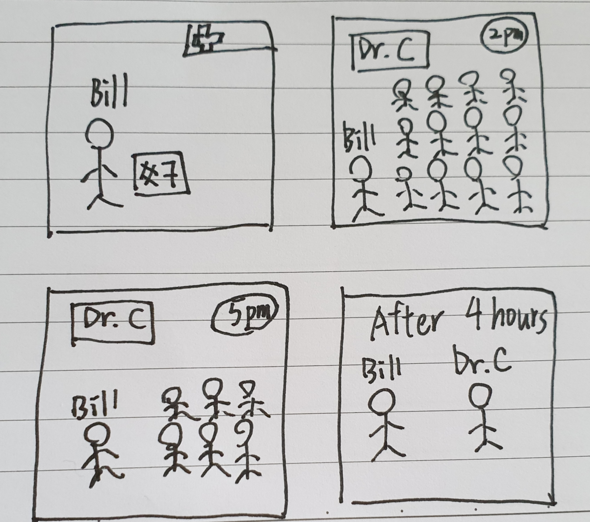

# Persona Assignment

--------------------------
* [Define Your Project Area](#Project_Area)
* [Brainstorm Persons](#Persona_Candidates)
* [Detailed Personas](#Detailed_Persona)
* [Problem Scenario & Value Proposition](#Problem_Scenario)
* [Epics of Problem Scenario & storyboard](#Epics_Storyboard)
* [Child Stories and Test Cases](#Child_Stories_and_Test_Cases)
--------------------------

## Project_Area

For doctors and patients in Taiwan, **Care Your Health** is an medical records management software that provides patients themselves to track their own medical records as well as let the doctors they visit to access to their historical medical records. This software is mainly to solve the problems that doctors in different clinics cannot access to the patient's medical records which means that doctors only have limited information of the patients. This will make the diagnosis less accurate compared with if they know all the medical history of a specific patient.

## Persona_Candidates

1. Bill an old patient who suffer from cancer
2. Daisy a young patient who suffer from flu recently
3. Peter a doctor with his own clinic
4. May an employee who work at Ministry of Health 
5. Chloe a data analyst specialise in healthcare industry

## Detailed_Persona

* Bill an old patient who suffers from cancer

  

  Bill is 75 years old and he lived in Taiwan. He was diagnosied with chronic leukemia when he was 70. He used to work out, did a lot of outdoor activities and ate healthy foods when he was still healthy. He cannot not figure out why he got cancer.

  Luckily, in Taiwan, the healthcare system is wonderful. Patients only have to pay little fee to get high quality medical resources. Bill feels very grateful that he doesn't need to worry about the huge amout of medical expenses. 

  Over the past five years, Bill had three times chemotherapy and the cancer is already under control. What he has to do is to take the special medicine everyday to control the cancer to avoid relapsing. He needs to visit the doctors every month to get the prescribed drugs. 

  Even though the disease is under control, he found out that body is not as strong as before (weak immune system). Therefore, he catches the cold frequently. Unlike healthy people, whenever Bill catches a cold, he needs to visit the doctor immediately. So he visited the doctor for more than 20 times within 5 years. 

  The things Bill didn't like while he visits the doctor are: spending a lot of time waiting in the queue and explaining to doctors his historical medical records.
  
  | Think | Bill thinks that the hospital/clinic should tell him the average waiting time before his turn since sometimes it takes more than 3 hours for him to wait in the queue. It's really inefficient. Besides, he hopes that doctors from different hospitals/clinics can be able to access his historical medical records to avoid mistreatment since he suffers from leukemia and his case should be treated specially compared with normal people. |
  | ----- | ------------------------------------------------------------ |
  | See   | While Bill visits doctors, he saw a lot of patients waiting in the queue for more than 2 hours. They are all very irritating and don't know when is their turn. And this happens a lot of time to them. Also, some of the patients hope that doctors from different hospitals/clinics can access to their historical medical records since sometimes they forget which drugs they are allergic to while taking those drugs might be fatal to them. |
  | Feel  | Bill really like the healthcare system in Taiwan since it help patient to cover most of the medical expenses. However, because of this reason, there are a people wasting the medical resources by visiting the doctors frequently and therefore those who are in need cannot get the medical resources in time. He feels like the healthcare system can be better if the government make some restrictions on reimburse the medical expenses. For example, those who catch a cold cannot get the reimbursement from government since people will take advantage of that by visiting doctors whenever they have minor issues. But, he thinks that the medical resources should give to people who really suffer from serious diseases such as cancer. |
  | Do    | On average, it takes Bill 2 hours to wait in the queue.  Besides, everytime when he visits different clinics, he needs to tell the doctor his past medical records since doctors from different clinics/hospitals cannot access patients' past medical records from different clinics/hospitals. |
  
  

## Problem_Scenario

| Problem Scenarios                                            | Current Alternatives                                         | Your Value Proposition                                       |
| ------------------------------------------------------------ | ------------------------------------------------------------ | ------------------------------------------------------------ |
| Don't know how long should wait for the queue?               | Waiting for 2 or 3 hours at hospital                         | Predicting average time taken for each patients              |
| Doctors from different clinics didn't know the special medical condition which will affect how they diagnose Bill | Spend time on explaining the special medical records to doctors at the new clinic | Patients should have the access to their own medical records. Perhaps, doctors from different clinics are able to access patients' medical records if patients allow |
| Drug prescription is monthly basis which means that patient need to revisit the doctors monthly | Bill visits doctors every month to get the medicine he needed to control leukemia | Might treatment patients with special conditions different in terms of drug prescriptions. For patients with chronic diseases, we should extend the drug prescription from 1 month to 3 months or 6 months. |

​	

## Epics_Storyboard

As Bill the patient, I want to know how long I need to wait for the queue before my turn, so that I can properly manage schedule instead of waiting there and wasting my time.

1. Bill went to the hospital and got the queue number 7. He thought he might need to wait for at most 1 hours only so he just stayed there instead of driving back home to take a rest.
2. When Bill went to waiting room, he found out that a lot of people already waiting there. And he asked those people how long they have already waited, people said around 2 to 3 hours.
3. So Bill keep waiting until 5 pm.
4. In the end, Bill finally saw the doctors at 6 pm which was 4 hours waiting.

## Child_Stories_and_Test_Cases

As Bill the patient, I want to know how long I need to wait for the queue before my turn, so that I can properly manage schedule instead of waiting there and wasting my time.

| Child story                                                  | Test cases                                                   |
| ------------------------------------------------------------ | ------------------------------------------------------------ |
| I know how many people waiting before me so that I can probably measure how much time I need to wait. | Make sure there is a system to properly measure how long patient should wait until their turn. |
| I don't know how many people waiting before me and I am not sure how long I should wait. | Make the waiting process transparent so that patient can easily find how many people waiting before them and how long I should wait. |

