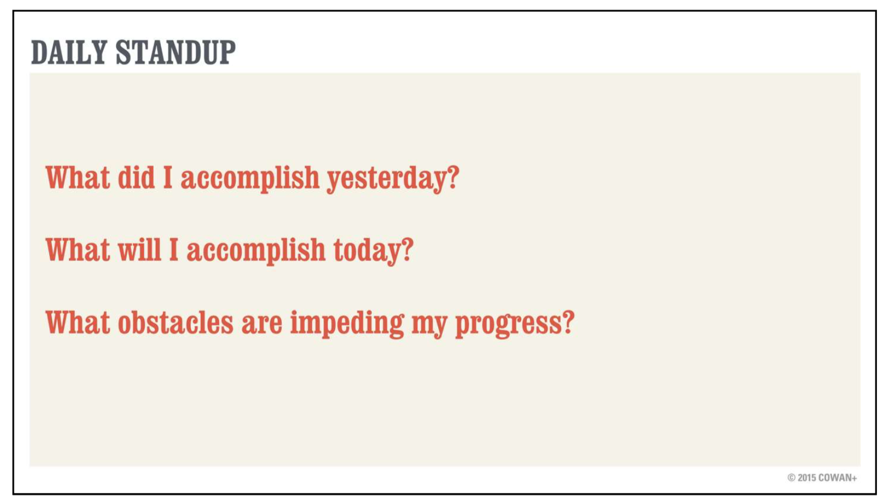

# Course Note

--------------------------
* [Course agenda](#Agenda)
* Lectures
  * [Course 1](#Course1)
  * [Course2](#Course2)
  * [Course 3](#Course3)
  * [Course 4](#Course4)
* [Venture Design Template](#Template)
--------------------------

# Agenda

| **Module** | **Topic**                                                    | **Videos**          | **Readings** | **Assessments**                 |
| ---------- | ------------------------------------------------------------ | ------------------- | ------------ | ------------------------------- |
| 1          | **Problems Agile Solves**                                    | 11 lessons = 66 min | 3 readings   | quiz                            |
| 2          | **Agile Design with Personas, Problem Scenarios, and Alternatives** | 11 videos = 68 min  | 0 readings   | quiz                            |
| 3          | **Writing Great Agile User Stories**                         | 7 videos = 46 min   | 2 readings   | peer-reviewed assignment        |
| 4          | **Enhancing Your User Story**                                | 17 videos = 69 min  | 1 reading    | quiz + peer-reviewed assignment |

## Course1

* What is Agile: A manifesto anchored in principles with a loose collection of practices

  Individuals interactions > Process tools

  Working software > Comprehensive documentation

  Customer collaboration > Contract negotitation

  Responding to change > Follow a plan 

  

* Agile Conecpt

  

  

  

  

  

  

## Course2 

* Create User story - think, see, feel, do

  * start with individual cases and then move to general

  

  

  

## Course3

* Prepare great user story

  * Problem scenario -> epic -> test cases

  

  

## Template

* Venture Design [Template](<https://docs.google.com/document/d/1ltO5VtLYMzVYF1siGln1YS_HzjNyhxobfpavEquFO2k/edit>)

