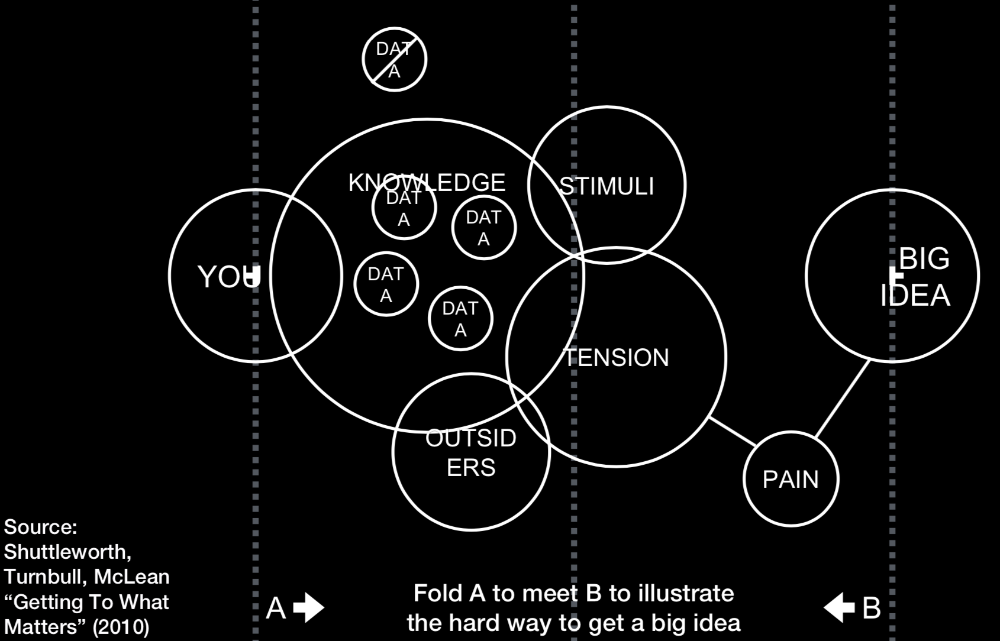
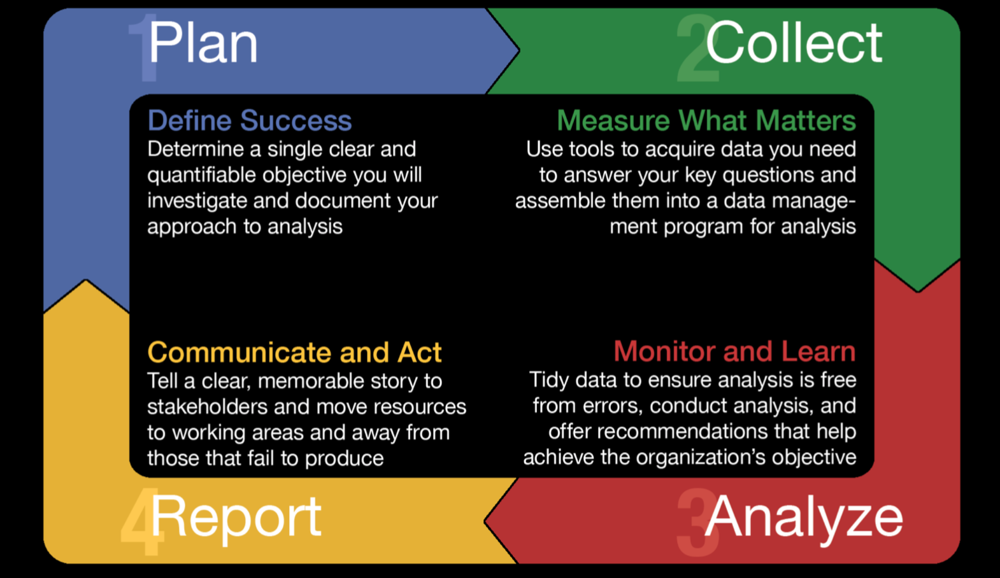

# Course Note

* Lectures
  * [Course 1](#Course1)
  * [Course 2](#Course2)
  * [Course 3](#Course3)
  * [Course 4](#Course4)
--------------------------

## Coursera1

* PAIN IS AN INEVITABLE PART OF ANY GOOD WEB ANALYSIS PROJECT

* Marketing Analysis Process (MAP): a step-by-step procedure for conducting thorough and insightful digital data analyses. 

* Plan
	* Establish the campaign / brand / company’s clear, singular objective to be addressed by your analysis
	* Define key questions you will be asking of the data
	* Identify the type of analysis you will be conducting and the resultant data you will need
	* Plan your approach to collecting your data — the data you require and the sources (and tools) you will use

* Collect
	* Locate sources that house the required data identified in the planning step
	* Utilize data mining tools and techniques necessary to collect required data
	* Select a data management system that balances your needs for power and simplicity
	* Ensure the effectiveness of future analysis by limiting bias in the data

* Analyze
	* Produce “tidy,” analysis-ready datasets to ensure your analysis is error-free
	* Proactively address data-quality issues and concerns
	* Perform analysis techniques that lead you to draw conclusions from collected data
	* Compress learnings into easy-to-understand snippets by constantly asking yourself, what’s the 60 seconds story?

* Report
	* Leverage preattentive attributes in visual perception to quickly and effectively communicate your meaning
	* Ensure that recommendations are as clear and concise as possible
	* Follow simple rules of design to visualize insights with impact
	* Connect to your audience with passion to ensure your story is memorable
	* Convey condense idea in 60 seconds

* Question 1: Describe how the three functional roles of marketing analytics (data strategist, techie, and data designer) are filled in your current organization or an organization of your choice.  

I work at a fintech startup and we have those roles in our company but we called them differently. For data strategist, I would rather say a marketing analyst. Those people will monitor business metrics (ex: web sessions, pageviews, conversation rate, CPA, CPC, etc) daily and then do A/B testings to make better marketing strategies to reduce cost but at the same time attract new customers and maintain existing customers. For techie, I would call it a data engineer. For them, their main job responsibility is to help us ensure we can get the information of what customers do while visiting our websites, or gathering customers' touching point. Besides, their role also includes building a stable infrastructure that can store all the customer information. For data designer, I will call it business intelligence. Their role is more on deciding what sort of information are useful for our company and how to leverage all this information to turn data into opportunities and make those data accessible for all internal users. 

* Question 2: Explain why you think "pain" is a necessary element in any good web analysis project.  

Quality analysis demands a quality approach. To get correct and useful insights, you must need to do a lot of work beforehand. For example, you need to ensure the data that you use for analysis is processing correctly; otherwise, it's just like a famous quote "Garbage in, Garbage out". You feed the model with incorrect data then you definitely will not get correct results. Besides ensuring the data quality, you must understand the domain knowledge of the data that you are analysing. If you do not understand the context fully, then the interpretation will be totally misleading, says misinterpretation. Also, data visualisation is also very important when you want to convey your idea to others. So, understanding the best practices of building the dashboards and creating the graph is also important.

