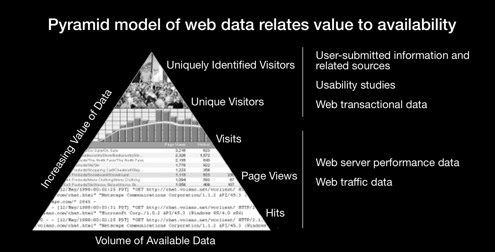
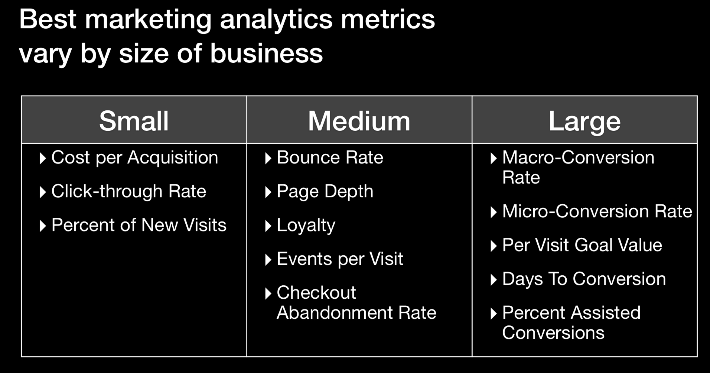
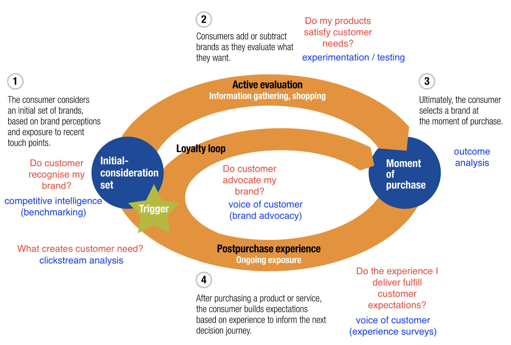
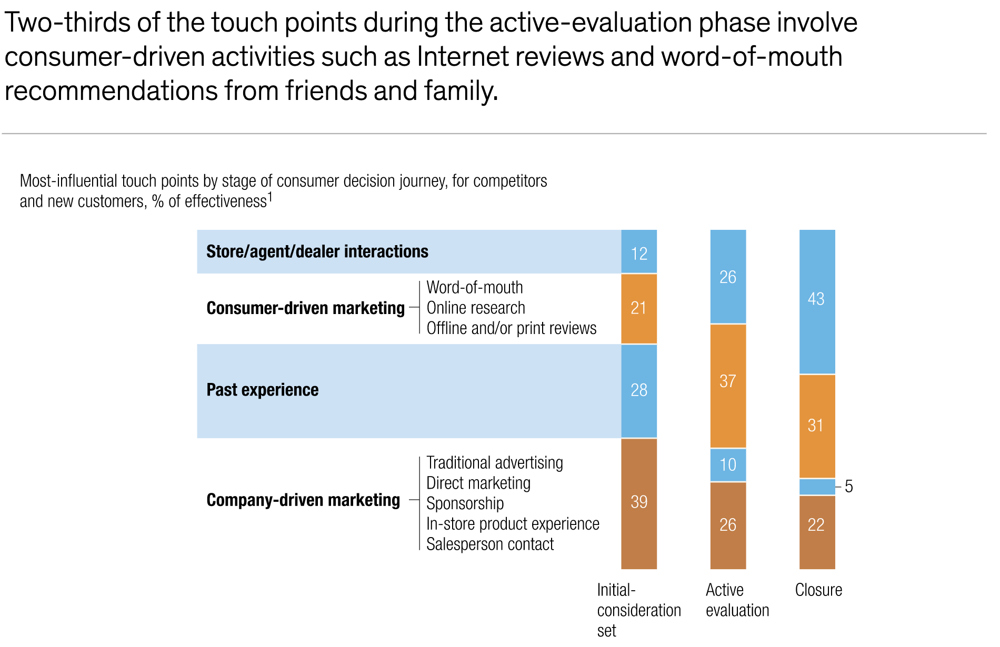
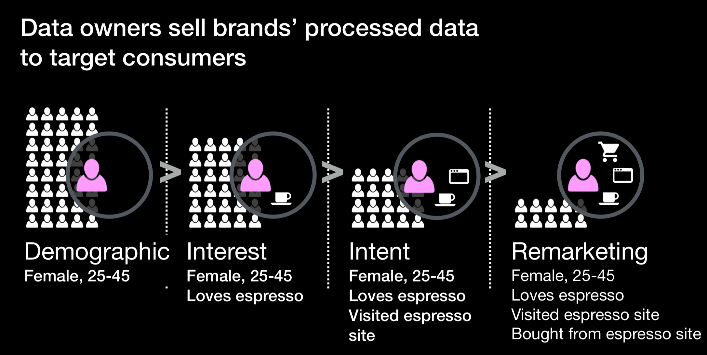

# Course Note

* Lectures
  * [Useful Resources](#Resources)
  * [Course 1](#Course1)
  * [Course 2](#Course2)
  * [Course 3](#Course3)
  * [Course 4](#Course4)
--------------------------

## Resources

* Open source raw data
  * [The US Bureau of Census](http://www.census.gov/)
  * [Bureau of Economic Analysis](http://www.bea.gov/)
  * [Bureau of Labor Statistics](http://www.bls.gov)
  * [DATA.GOV](http://www.data.gov)
  * [Center for Disease Control and Prevention Statistics](http://www.cdc.gov/DataStatistics/)
  * [UNdata](http://data.un.org)

* Processed visual data
  * [FlowingData](http://flowingdata.com/)
  * [Information is Beautiful](http://www.informationisbeautiful.net/)
  * [Marketing Chart](https://www.marketingcharts.com/)

## Course1

* 3-step model of marketing
  * Stimulus
  * First Moment of Truth (At shelf: in store)
  * Second Moment of Truth (After shop: experience)

Things change: Zero Moment of Truth (I-store/Pre-shopping) -> The Zero Moment of Truth (ZMOT) is the phase when the customer is researching purchase options using various sources of information. This is the time when the customer puts out a great amount of rich, valuable information that can be captured by a marketing analyst.

* Do you think the addition of ZMOT by Google in the 3-step model of marketing has made it better? If yes, why? If not, why not?

  Yes. In the age of Internet of Things, the way how people shop has changed a lot (including making purchasing decisions). Nowadays, more and more people choose to read through the online reviews before purchasing and then instead of buying from physical store they choose to shop online. Given the fact, companies try to know more about customers' buying intentions, behaviours to provide better product recommendations, customer experience etc through the information they left while browsing the website, says understanding the customer journey. Becasue of those reasons, I think Google's ZMOT makes 3-step model better.

## Course2

* Note for reading lists
	* Purpose of web analytics: understand the online experience such that it can be improved
  * Ability to Measure Traffic from Robots and Spiders
  * Click through rate might be misleading -> what's more important is response rate
  * Many definition of conversation rate -> define the one make more sense
  * A/B Testings
    * Only change one variable at a time
  * Terminology
    * Click-Through Rate: the number of people who click on a particular thing - banner ad, link, etc
    * Visit: same as sessions and user sessions
  

* Collect customers' information

  * Cookies: Cookies are small files which are stored on a user's computer. They are designed to hold a modest amount of data specific to a particular client and website, and can be accessed either by the web server or the client computer -> identify users
  * Tags: javascript code that track customer 

* Pyramid model of web data

  

  

* Marketing Metrics by size of the company

  

  

* Think about the value of various data sources and marketing analytic tools and the importance of the role that the analyst plays during the process of decision making. Then respond to the following question:

  - In one of the lectures, the instructor mentions that "No tool is ever as valuable as the analyst." Do you agree with this statement? Explain your opinion by providing a reasonable argument along with one or two examples.

    Yes, I agree with the statement that an analyst is more important than the tools. There are two main reasons that I support this argument. Firstly, the tools can only get "the fact" but not the "insight". For example, the tools can get how many people visit our pages, their customer journey, etc but they cannot help you figure "why", says why customers have this kind of behaviours and that's what analysts can do but the tools cannot. Secondly, sometimes the numbers that the tools provide might be biased. For example, if the click-through rate (CTR) is high, does that really mean your website is good? Sometimes, the CTR is high but truth is that customers click the button because of the fancy title that it has but the truth is that they might exit the page immediately because it's not what they expect. So based on this perspective, I think the role of an analyst is important because they need to make sure the numbers are interpreted correctly and help make correct business decisions.

## Course3

* Stimulus -> zero moment of truth (ZMOT: pre-shopping, I-store, In-home) -> First moment of truth (At shelf, in store) -> Second moment of truth (Experience) 

* Customer Decision Journey (McKinsey)
  * circular journey
    
  * outreach of consumers to marketers has become dramatically more important than marketers’ outreach to consumers
    

* Aligning marketing with the consumer decision journey
  * perhaps from focusing brand advertising on the initial-consideration phase to developing Internet properties that help consumers gain a better understanding of the brand when they actively evaluate it
  * more consumers hold off their final purchase decision until they’re in a store -> Merchandising and packaging have therefore become very important selling factors

* Channels to develop consumer relationships
  * search
    * SEM: paid ads at the top of google search page
    * SEO: organic result optimisation
  * display
  * video
  * social
  * Think about how brands can develop relationships with consumers, and evaluate the effectiveness of the four digital channels based on your own experience. Then respond to the following question:  
  According to your experience and opinion, which is most effective? Explain your rationale with one or two examples of companies who are utilizing that channel.  

  I think those four digital channels are important in terms of different perspectives, but among all, I think "search" might be the most effective channel because of two reasons. Firstly, a lot of companies invest a lot on SEO because it will directly impact on web traffic. Being in the top of the search engine result page can get more visibility compared with the second or the third pages. Besides, SEO also targets the "quality traffic" because Google algorithm will match customers' search keywords with your website content, if it's relevant then they will recommend to customers. Because of this, you can attract the customers who already have some buying intentions and they are more likely to purchase your products/services. Aside from SEO, SEM also plays an important role in generating web traffic and arising brand awareness. According to Google, search ads can increase brand awareness by 80%. Even if ads don’t receive clicks, brand names are still clearly visible on the top of the fold, and searchers may still read or recognize the product, brand name or URL when they see the ad.  

  I think MoneySmart SG did quite well in terms of SEO and SEM. Whenever people type credit card or some financial products the top page is definitely showing moneysmart website (if you are in Singapore) for users to make better financial decisions.

## Course4

* Data owners sell brands' processed data to target customers
  * Data related: Demographic -> Interest -> Intent -> Remarketing
    

* The article "New Ways Marketers Are Manipulating Data to Influence You" talks about retargeting, a new form of targeted advertising that collects and analyzes personal information (such as credit card histories and web habits) to display personalized ads to consumers. Think about targeted advertising in terms of how it displays personalized ads to customers, and discuss how these techniques could impact you as a consumer, a marketer, or in another role that you play in a selected scenario. Then respond to the following question:  

Discuss whether you are personally in favor of the retargeting technique to achieve targeted ads. Explain the rationale behind your opinion.  

Personally, I think retargeting technique is an efficient way for marketers in terms of cost perspective. Before the Internet of Things, marketers cannot easily understand or track customers' journey, says what kind of website they are browsing, what's their action while browsing, etc. Thus, marketers cannot display personalised ads which means every people will see the same ads even though most are not interested in. 
But nowadays, marketers can easily get the information of what customers really want/look for and therefore marketers can directly show the targeted ads to them. Personalisation and Customisation not only make customers feel like they are being valued but also company is optimising their marketing cost by targeting the "right" group of people at the same time. 

​		